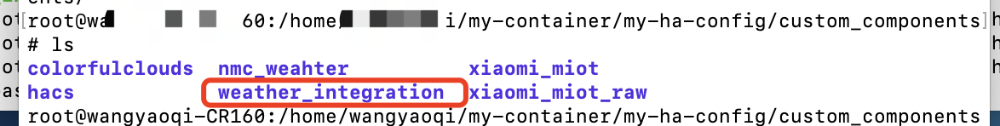
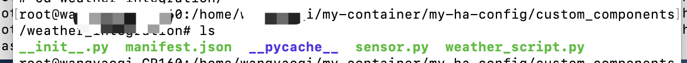
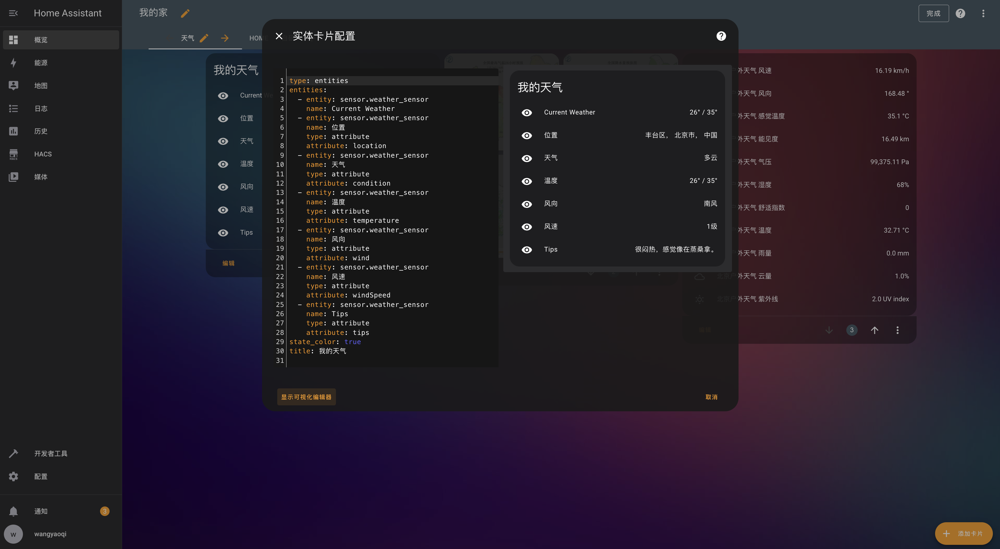
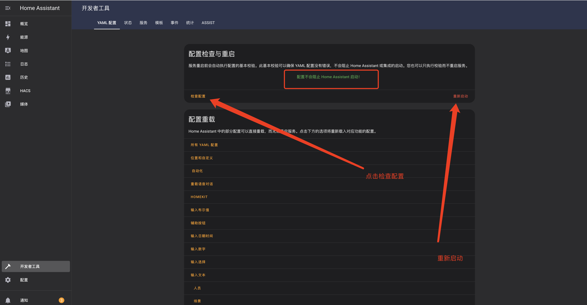
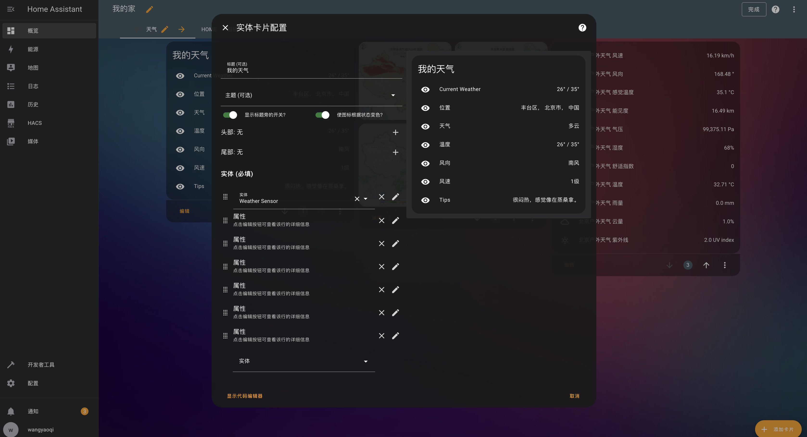

## 了解自定义带来的玩法
随着设备的使用，稳定输出相关自动化场景与监测，可以自定义脚本用来执行需要的东西，目前自定义一个小的传感器实体进行天气的爬取与显示，如果需要更多玩法也可以慢慢的探索

## 首先需要了解HA目录结构，方便后续布局部署
首先理解下HomeAssist的目录，与开发者的配置
1.文件夹下custom_components 该文件下用于存储自研的插件脚本与相关传感器实体软件
2.configuration.yaml 配置文件
3.blueprints 主题文件也放在根目录下即可

## 天气插件放入位置


## 项目文件内容


## 代码文件

### __init__.py 
``` bash
DOMAIN = "weather_integration"

async def async_setup(hass, config):
    """Set up the weather integration."""
    return True
```

### manifest.json
``` bash
{
    "domain": "weather_integration",
    "name": "Weather Integration",
    "version": "1.0.0",
    "requirements": ["requests", "lxml"],
    "codeowners": ["@your_github_username"],
    "iot_class": "cloud_polling"
}

```
### manifest.json
``` bash
import logging
from homeassistant.helpers.entity import Entity
from .weather_script import get_weather

_LOGGER = logging.getLogger(__name__)

async def async_setup_platform(hass, config, async_add_entities, discovery_info=None):
    async_add_entities([WeatherSensor(hass)])

class WeatherSensor(Entity):
    """Representation of a Weather Sensor."""

    def __init__(self, hass):
        self._hass = hass
        self._state = None
        self._attr = {}

    @property
    def name(self):
        return "Weather Sensor"

    @property
    def state(self):
        return self._state

    @property
    def extra_state_attributes(self):
        return self._attr

    async def async_update(self):
        try:
            weather = await self._hass.async_add_executor_job(get_weather)
            self._state = weather['temperature']
            self._attr = {
                "location": weather['location'],
                "condition": weather['condition'],
                "temperature": weather['temperature'],
                "wind": weather['wind'],
                "windSpeed": weather['windSpeed'],
                "tips": weather['tips']
            }
        except Exception as e:
            _LOGGER.error("Error updating weather sensor: %s", e)
            self._state = None
            self._attr = {}
``` 
### weather_script.py
``` bash
import requests
from lxml import etree

def get_weather():
    url = 'https://tianqi.moji.com/'
    headers = {
        "Host": "tianqi.moji.com",
        "Accept": "*/*",
        "User-Agent": "Mozilla/5.0 (Linux; Android 8.0.0; SM-G955U Build/R16NW) AppleWebKit/537.36 (KHTML, like Gecko) Chrome/87.0.4280.141 Mobile Safari/537.36",
        "Connection": "keep-alive",
        "Cookie": "Hm_lvt_f943519a2c87edfe58584a4a20bc11bb=1650868412; Hm_lpvt_f943519a2c87edfe58584a4a20bc11bb=1650868484",
        "Accept-Encoding": "gzip, deflate, br",
        "Accept-Language": "zh-CN,zh;q=0.9",
    }
    response = requests.get(url, headers=headers, verify=False, timeout=30)
    html_xml = etree.HTML(response.text)

    weather_data = {
        "location": html_xml.xpath("/html/body/div[3]/div[2]/div[1]/div[1]/em/text()")[0].strip(),
        "condition": html_xml.xpath("//div[@class='forecast clearfix']/ul[@class='days clearfix'][1]/li[2]/text()")[1].strip(),
        "temperature": html_xml.xpath("//div[@class='forecast clearfix']/ul[@class='days clearfix'][1]/li[3]/text()")[0].strip(),
        "wind": html_xml.xpath("//div[@class='forecast clearfix']/ul[@class='days clearfix'][1]/li[4]/em/text()")[0].strip(),
        "windSpeed": html_xml.xpath("//div[@class='forecast clearfix']/ul[@class='days clearfix'][1]/li[4]/b/text()")[0].strip(),
        "tips": html_xml.xpath("//div[@class='wrap clearfix wea_info']/div[@class='left']/div[@class='wea_tips clearfix']/em/text()")
    }
    return weather_data
```

### 配置文件 修改vim  configuration.yaml 

``` bash
# Loads default set of integrations. Do not remove.
default_config:

# Load frontend themes from the themes folder
frontend:
  themes: !include_dir_merge_named themes

automation: !include automations.yaml
script: !include scripts.yaml
scene: !include scenes.yaml

sensor:
  - platform: weather_integration
    name: Weather Sensor
    scan_interval: 300
```

## Ha卡片配置

``` bash
type: entities
entities:
  - entity: sensor.weather_sensor
    name: Current Weather
  - entity: sensor.weather_sensor
    name: 位置
    type: attribute
    attribute: location
  - entity: sensor.weather_sensor
    name: 天气
    type: attribute
    attribute: condition
  - entity: sensor.weather_sensor
    name: 温度
    type: attribute
    attribute: temperature
  - entity: sensor.weather_sensor
    name: 风向
    type: attribute
    attribute: wind
  - entity: sensor.weather_sensor
    name: 风速
    type: attribute
    attribute: windSpeed
  - entity: sensor.weather_sensor
    name: Tips
    type: attribute
    attribute: tips
state_color: true
title: 我的天气
```
### 文件部署后，检查配置及重载yaml生效


### 结果展示



