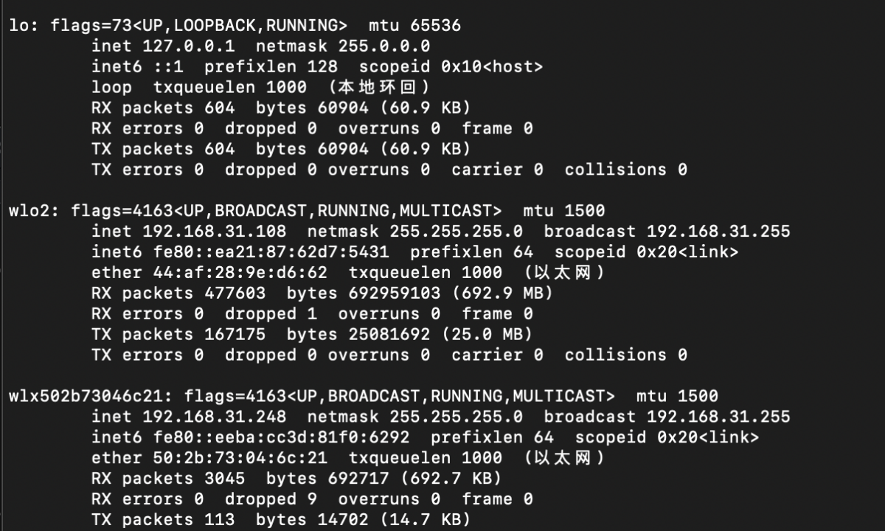

## 第一步：硬件选材与选用技术

### 1. 钢铁侠定制主机
我选择了宁美魔方 CR160 8+256G 钢铁侠定制版本的主机。主要原因有两个：
- 我喜欢钢铁侠，定制版本的外观设计和性能配置都吸引了我。
- 定制版本与非定制版本价格相同且优惠，我毫不犹豫地选择了钢铁侠定制版本。

### 2. 固态硬盘
我选择了 2.2 NGFF 的梵想固态硬盘。固态硬盘的读写速度较快，能够提供良好的系统性能和响应速度。我通过京东购入时获得了优惠，2023 年价格也非常便宜。

### 3. 硬盘盒磁盘阵列
在购买硬盘盒时，我选择了带有磁盘阵列功能的硬盘盒，选用了 2*2T 的 RAID1（镜像模式），提供更高的数据冗余和安全性。一旦一块硬盘损坏，数据仍然可以恢复。硬盘盒的价格较高。

### 4. 外置无线网卡
如果主机支持有线连接和自带无线网卡，可以不买外置无线网卡。为了实现双网卡配置和更好地连接 NAS 及智能家居设备，我选择了绿联 8810C 外置无线网卡。该网卡需要降低 Ubuntu 内核才能安装驱动，我成功实现了双网卡配置。

---
## 新手小白如何了解 NAS 与 Docker

双网卡配置为了 NAS、智能家居与 NET，Mac 笔记本电脑的 Docker  经过测试不是模式不支持是因为不应该映射网络 应该用host模式与主机保持同意网络环境 。

### 一、网卡与 Ubuntu 内核的关系
网卡：绿联 8810C 需要的内核为 18.04，最高支持 5.3。安装后版本大于 5.3，果断选择最新的系统内核（如 Ubuntu 20.04.01，内核为 5.4）。

### 二、网卡安装步骤
1. 下载所需依赖工具包：
   ```bash
   sudo apt install net-tools
   sudo apt update
   sudo apt install build-essential
   ```


2. 网卡驱动下载：
    github项目或者官方（由于官方没有提供通过github下载支持这款型号的网卡即可）
    安装方式：
    将驱动文件夹提取到桌面上,或者Python -m http.server 9999  启用一个服务  用wget下载下来，没有wget就换个方式下载
    
    打开终端输入：cd 桌面/rtl8821CU/  注：不同系统可能桌面位置不同，如果不确定可以百度搜索下 
    
    进入文件夹后输入：sudo make 密码需要输入当前使用账户密码
    
    输入ls 查看8821cu.ko文件有没有生成
    
    输入sudo make install  提示已经将驱动放入内核
    
    可见结果：图形直接连（命令见下方命令）
    


#### 命令连接wifi教程：
1. 查看周围wifi信息
    
    确保您的两个无线网卡都可以正常工作并已正确安装在您的计算机上。

    打开终端或命令提示符，运行以下命令以查看当前的网络接口列表：
    ifconfig -a
    这将列出您的计算机上所有的网络接口，包括无线网卡。
    
    确定要连接的无线网络的名称（SSID）和密码。确保您已正确配置了这些信息。

    运行以下命令来连接第一个无线网卡到目标网络：

    sudo nmcli device wifi connect <SSID> password <password> ifname <interface>
    将 <SSID> 替换为目标网络的名称，<password> 替换为网络的密码，<interface> 替换为第一个无线网卡的接口名称（例如 wlo2）。

    运行以下命令来连接第二个无线网卡到目标网络：

    sudo nmcli device wifi connect <SSID> password <password> ifname <interface>

    将 <SSID> 替换为目标网络的名称，<password> 替换为网络的密码，<interface> 替换为第二个无线网卡的接口名称（例如 wlo3）。

    等待一段时间，让系统完成连接并获取 IP 地址再通过ifocnifg查看
    

## 安装docker
在 Ubuntu 上安装 Docker 的步骤如下：

打开终端或命令行界面。

更新系统软件包列表，运行以下命令：

sudo apt update
安装 Docker 的依赖软件包，运行以下命令：
sudo apt install apt-transport-https ca-certificates curl software-properties-common


添加 Docker 的官方 GPG 密钥，运行以下命令：
curl -fsSL https://download.docker.com/linux/ubuntu/gpg | sudo gpg --dearmor -o /usr/share/keyrings/docker-archive-keyring.gpg

添加 Docker 的稳定版本软件源，运行以下命令：(截止2024-07-15 前如果这个如果能下就不用换)
echo "deb [arch=amd64 signed-by=/usr/share/keyrings/docker-archive-keyring.gpg] https://download.docker.com/linux/ubuntu $(lsb_release -cs) stable" | sudo tee /etc/apt/sources.list.d/docker.list > /dev/null


更新软件包列表，运行以下命令：
sudo apt update
安装 Docker 引擎，运行以下命令：
sudo apt install docker-ce docker-ce-cli containerd.io

验证 Docker 是否成功安装，运行以下命令检查 Docker 版本：
docker --version

如果成功安装，将显示 Docker 的版本信息。

Ifconfig：检测网卡docker的容器网卡


#### docker安装home-assistant：（智能家居容器）
整理思路，首先在自己喜欢的个人目录上创建一个docker文件，这个文件是用来映射所有容器的config
例如我在home/user 下创建的：my-container


然后下载home-assistant，运行以下命令：（注意 不是sudo要用sudo 切到管理员）
sudo docker pull homeassistant/home-assistant


创建一个新的 Docker 容器来运行 Home Assistant。运行以下命令：

docker run -d --name homeassistant -p 8123:8123 -v /path/to/config:/config homeassistant/home-assistant


我的命令：docker run -d --name homeassistant -p 8123:8123 -v /home/wangyaoqi/my-container/my-ha-config:/config homeassistant/home-assistant


查看端口

ip 物理网卡查询进行访问都可以


进入首页：

配置网络：
一定先配置网络，有有线网卡的不用管
第一步：打开高级模式

第二步 重启系统，稍后进入系统：


坑：再来： docker的定义关于容器网络的设定，必须重新安装容器才可以修改网络
删除docker重新安装，以后可以配置docker-conpose.yml 进行配置及挂载设定  目前这个项目软件无需挂载，默认即可
命令：
docker ps -a （查询容器ID）
停止容器
docker stop 容器ID
删除容器
docker em 容器ID


重新安装：先了解下docker的网络模式：
Docker 提供了几种网络模式来连接和隔离容器。下面是几种常见的 Docker 网络模式：

桥接网络（Bridge Network）：这是 Docker 默认的网络模式。在桥接网络中，容器连接到一个虚拟网桥，该网桥与主机的物理网络接口连接。容器可以相互通信，并可以使用主机上的端口映射到容器内部的端口。

主机网络（Host Network）：在主机网络模式中，容器与主机共享网络命名空间，直接使用主机的网络接口。这意味着容器可以使用主机上的所有网络接口和端口，不需要进行端口映射。但是，容器之间的网络隔离性较差。

none 网络（None Network）：在 none 网络模式中，容器没有网络连接。这意味着容器无法通过网络访问外部系统，也无法被外部系统访问。none 网络模式适用于特定的安全要求或仅需要本地访问的容器。

自定义网络（Custom Network）：Docker 还允许创建自定义网络，以便在容器之间创建专用的网络环境。自定义网络提供了更高级的网络功能，例如容器名称解析和容器发现。可以使用 Docker CLI 或 Docker Compose 来创建和管理自定义网络。

使用 Docker 默认的桥接网络可以满足大多数容器的网络需求。如果需要更复杂的网络配置或容器之间的通信，可以考虑使用自定义网络。


### 先查看下docker网络信息
docker network ls


查看特定网络的详细信息：
docker network inspect <network-name>


学习了下doker的网络，那么我们选择host网络与主机一样，使用 --network host 参数将容器连接到主机网络，从而绕过 Docker 的网络虚拟化，并直接使用主机网络接口。
命令如下：
docker run -d --name homeassistant --network host -v /home/wangyaoqi/my-container/my-ha-config:/config homeassistant/home-assistant


开始配置吧

安装hacs，首先要有这个集成包，需要下载，目前的容器目录见截图


在我们安装容器的目录新建一个文件夹


刷新我们网站的后台；http://192.168.31.108:8123/config/dashboard   端口号默认为8123

安装hacs集成：通过这个集成去下载更多的智能插件


我的hacs过期了可以git找 不过也不需要这个东西


我有本地小米包扩展，直接安装


接入小米账号，家里面如果有局域网 应该在开始的时候自动就会显示出网关
下一步，继续找到苹果的桥接程序添加集成，右侧通知扫码添加

暂时不开启外网访问，后续开启，用于在外面通过访问服务器进行控制家庭设备，但不是很友好，不方便，不能在家庭操作，准备购入homepad吧，对比了几款网关产品，pad不适合长时间使用，appletv家里没有电视不需要，选择homepad入手，目前二手价格在500左右，全新的700 （2023-03-15）

## 域名解析服务，一键部署

 DDNS解析华为云，找了很多，小米路由器无法自动解析，家里的网络不是大内网，什么是大内网，大内网就是外网ip无法ping通也就是无法解析了


#### ddns-go 开始去github上找项目，ddns-go安装部署很快
首先下载下来这个项目，我们开始有了思路
先创建一个自己喜欢的项目目录，比如my-ddns-server
开始创建

创建好后去github下载下来，准备部署服务记住

开始创建一个常驻脚本 不用nob 选择守护进程

首先安装下命令：
sudo apt-get install supervisor

/etc/supervisor/conf.d/这个目录为配置进程文件的目录，默认把ddns-go安装在这里
创建一个配置文件开始
sudo nano /etc/supervisor/conf.d/ddns-go.conf
配置文件内容：
[program:ddns-go]
command=/path/to/ddns-go          ; 替换为实际的 ddns-go 可执行文件路径
autostart=true
autorestart=true
stderr_logfile=/var/log/ddns-go.err.log
stdout_logfile=/var/log/ddns-go.out.log

保存并退出编辑器。
更新 supervisor 配置：
Copy code
sudo supervisorctl reread
sudo supervisorctl update


启动这个守护进程
sudo supervisorctl start ddns-go

默认是启动的不允许再启动

现在，ddns-go 将在后台以守护进程的方式运行。
查看守护进程的脚本：sudo supervisorctl status

重新启动命令：sudo supervisorctl restart ddns-go
服务地址：端口为7896：
http://192.168.31.108:9876/


安装一个媒体库  
Jellyfin   官方文档：8096


搜索docker资源
sudo docker search XXX
 复制资源到docker中
sudo docker cp /path/to/source/file_or_directory container_name:/path/to/destination


安装一个nastool 端口为3000s


安装naslab 调研后清晰好用  后期主要使用 embl了
docker run -d --name nascab --network host -v /home/wangyaoqi/my-container/my-nascab-config:/config -v /DATE:/media  ypptec/nascab


## Lsblk 磁盘路径查

磁盘挂在将新安装的硬盘挂载到 /datefile 目录，您可以按照以下步骤进行操作：

首先，创建一个用于挂载的目标文件夹，例如 /datefile：

sudo mkdir /datefile
然后，使用 mount 命令将 sdb2 分区挂载到 /datefile 目录：

sudo mount /dev/sdb2 /datefile
在这个命令中，/dev/sdb2 是新硬盘上的分区路径，/datefile 是您想要将其挂载到的目标文件夹。

如果您希望每次系统启动时都自动挂载该硬盘分区，可以将其添加到 /etc/fstab 文件中。编辑 /etc/fstab 文件，并在文件末尾添加以下一行：

/dev/sdb2  /datefile  ext4  defaults  0  2
这会告诉系统在启动时自动将 sdb2 分区挂载到 /datefile 目录，并使用默认的 ext4 文件系统选项。请确保将文件系统类型（ext4）替换为您实际使用的文件系统类型。
保存并关闭 /etc/fstab 文件。
完成挂载后，您可以通过访问 /datefile 目录来查看和使用新硬盘上的内容。
请注意，在执行挂载命令时，确保您具有足够的权限（使用 sudo）和正确的分区路径。确保已创建的目标文件夹存在，并且挂载点路径是正确的。


关于服务器监控温度，因服务器是迷你主机，发热严重，需观察，所需下载sensors软件包安装
sudo apt-get install lm-sensors


网络net解决方法：
光猫拨号无法net，想观察网络是不是光猫账号权限问题，通过telnet连入光猫ip，输入admin admin 访问终端，通过终端控制查看命令行：CUAdmin为命令  CUAdmin get 获取超级管理账号密码  

新问题：
管理员页面无法没有正常打开，无法查看权限，那么修改桥接

Df -h 查询磁盘目录
 umount /datefile 
卸载挂在
