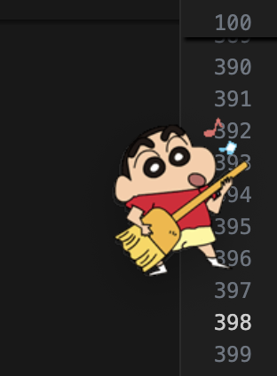

# 我用 Electron 构建桌面精灵——桌宠

最近，我萌生了一个想法——为桌面添加一个可爱的小精灵，类似以前 QQ 上的企鹅。调研了几款市面上的桌宠应用后，我决定自己动手用 [Electron](https://www.electronjs.org/) 做一个属于自己的桌面宠物。

## 调研与灵感来源

目前市面上有不少桌宠相关应用和插件：

- **VS Code 插件：vscode-pets**  
  虽然有趣，但局限于代码编辑器中，无法做到全局使用，团队合作也难以安装共享。
  
- **开源应用：大鹅桌宠**  
  功能很丰富，但部分高级功能需要付费。

- **其他桌宠**  
  价格在 100 元左右的宠物应用，但功能和体验差强人意。

> 我最终的目标是实现一个类似以前 QQ 企鹅的桌宠，从基础功能开始，逐步扩展。

## 技术选型

为了便于跨平台实现和丰富功能，我选择了以下技术栈：

- **Electron**：搭建桌面应用的基础框架，支持多平台。
- **HTML + CSS + JavaScript**：实现精灵的前端页面和交互逻辑。
- **Node.js**：处理后台逻辑和数据管理。

## 功能规划

### 基础功能
1. **精灵的基本展示**
   - 动画效果（站立、行走、睡觉）。
2. **简单交互**
   - 鼠标拖动精灵。
   - 精灵随时间变化进行动作切换。

### 后续功能扩展
- 多宠物选择（支持更换不同的角色形象）。
- 自定义宠物对话和表情。
- 模拟天气、时间等动态环境。

---

## 实现步骤

### 1. Electron 项目初始化

首先安装 Electron，并创建项目：

```bash
# 初始化项目
npm init -y

# 安装 Electron
npm install electron --save-dev

# 配置 package.json，添加启动脚本：
"scripts": {
  "start": "electron ."
}
```
### 2. 项目目录结构
```bash
project/
├── main.js       # Electron 主进程
├── index.html    # 精灵界面
├── renderer.js   # 前端逻辑
├── assets/       # 存放精灵图片和动画
│   └── images/
│       └── pet.gif   # 存放精灵图片和动画等资源目录
├── styles.css    # 页面样式
```
### 3. Electron 主进程代码
```bash
const { app, BrowserWindow } = require('electron');

let win;

app.on('ready', () => {
  win = new BrowserWindow({
    width: 400,
    height: 400,
    frame: false, // 去掉窗口边框
    transparent: true, // 背景透明
    alwaysOnTop: true, // 始终置顶
    webPreferences: {
      nodeIntegration: true,
    },
  });

  win.loadFile('index.html');
});
```
### 4. 精灵界面代码
```bash
<!DOCTYPE html>
<html lang="en">

<head>
  <meta charset="UTF-8">
  <meta name="viewport" content="width=device-width, initial-scale=1.0">
  <title>橙功君</title>
  <style>
    body {
      margin: 0;
      padding: 0;
      background: transparent;
      overflow: hidden;
    }

    #clj {
      width: 100px;
      height: 100px;
      background: transparent;
      background-image: url('assets/CLJ/resource/eat/gifmaker_me.gif');
      /* 默认背景图 */
      background-size: cover;
      /* 背景图片覆盖整个区域 */
      background-position: center;
      /* 图片居中 */
      position: absolute;
      cursor: pointer;
      z-index: 1000;
      /* 确保图标在最前面 */
      user-select: none;
      /* 禁止选中文本，避免拖动时出现不必要的副本 */
    }

    .menu {
      position: absolute;
      display: none;
      background: transparent;
      /* background: rgb(213, 196, 196); */
      /* border: 1px solid #ddd;
      box-shadow: 0 2px 5px rgba(0, 0, 0, 0.2); */
      padding: 10px;
    }

    .menu button {
      z-index: 1001;
      background: #d2b1b1;
      border: none;
      padding: 8px;
      cursor: pointer;
    }

    .menu button:hover {
      background: #f0f0f0;
    }
  </style>
</head>

<body>

  <div id="clj"></div> <!-- 区域 -->

  <!-- 菜单 -->
  <div class="menu" id="menu">
    <button onclick="startWalk()">散步</button>
    <button onclick="startFall()">下落</button>
    <button onclick="startIdle()">休息</button>
    <button onclick="eat()">eat</button>
    <button onclick="study()">Study</button>
    <button onclick="closeWindow()">退出</button>
  </div>

  <script>

    const petElement = document.getElementById('clj');
    let isWalking = false; // 用于判断是否处于散步状态
    let isDragging = false;
    let offsetX, offsetY;
    let currentState = 'default'; // 记录当前状态: 'default', 'walk', 'fall', 'idle'
    let currentImage = 'assets/CLJ/resource/eat/gifmaker_me.gif'; // 用于保存当前的背景图片

    const defaultImage = 'assets/CLJ/resource/eat/gifmaker_me.gif';
    // 各种状态对应的背景图
    const stateImages = {
      walk: 'assets/CLJ/resource/eat/sanbu.png',     // 散步
      fall: 'assets/CLJ/resource/eat/xialuo.gif',     // 下落
      idle: 'assets/CLJ/resource/eat/xiuxi.png', // 休息
      study: 'assets/CLJ/resource/eat/study.png',    // 学习
      eat: 'assets/CLJ/resource/eat/eat.png',      // 吃饭
      default: defaultImage,
    };


    // 禁止浏览器默认的拖拽行为
    petElement.ondragstart = function () {
      return false;
    };

    // 设置元素不可拖拽
    petElement.setAttribute('draggable', false);

    // 监听鼠标按下事件，开始拖动
    petElement.addEventListener('mousedown', (event) => {
      // 启动拖动状态
      isDragging = true;

      // 计算鼠标相对于宠物的位置偏移量
      offsetX = event.clientX - petElement.offsetLeft;
      offsetY = event.clientY - petElement.offsetTop;

      // 设置点击时背景图片为下落状态的图片
      petElement.style.backgroundImage = `url('${stateImages.walk}')`;

      // 保存当前点击时的背景图片
      currentImage = clickedImage;

      // 设置拖动时透明度为0，避免副本出现
      petElement.style.opacity = '0.5';

      // 关闭过渡效果，确保拖动时流畅
      petElement.style.transition = 'none';

      // 禁用文本选择和图片拖动，避免干扰
      event.preventDefault();
    });

    // 监听鼠标移动事件，更新宠物位置
    document.addEventListener('mousemove', (event) => {
      if (isDragging) {
        // 更新CLJ的位置
        const x = event.clientX - offsetX;
        const y = event.clientY - offsetY;
        petElement.style.left = `${x}px`;
        petElement.style.top = `${y}px`;

        // 获取当前CLJ区域的位置
        const petRect = petElement.getBoundingClientRect();

        // 计算CLJ窗口的新位置
        const windowX = window.screenX + (x - offsetX);
        const windowY = window.screenY + (y - offsetY);

        // 更新CLJ窗口的位置
        window.moveTo(windowX, windowY);
      }
    });

    // 监听鼠标松开事件，停止拖动并恢复原图
    document.addEventListener('mouseup', () => {
      isDragging = false;
      petElement.style.transition = 'left 0.2s ease, top 0.2s ease'; // 恢复过渡效果

      // 恢复透明度
      petElement.style.opacity = '1';

      // 恢复背景图片为当前状态对应的图片
      petElement.style.backgroundImage = `url('${stateImages[currentState]}')`;
    });

    // 右键菜单逻辑
    petElement.addEventListener('contextmenu', (event) => {
      event.preventDefault();
      const menu = document.getElementById('menu');
      menu.style.display = 'block';
      menu.style.left = `${event.clientX}px`;
      menu.style.top = `${event.clientY}px`;
    });

    // 点击其他区域时隐藏菜单
    document.addEventListener('click', () => {
      document.getElementById('menu').style.display = 'none';
    });


    // 动作函数
    function startBehavior(behavior) {
      // 如果当前行为优先级较低（如闲置），则切换行为
      if (currentState !== 'drag' && currentState !== behavior) {
        currentState = behavior;
        petElement.style.backgroundImage = `url('${stateImages[behavior]}')`;

        // 模拟动作完成后恢复到闲置状态
        setTimeout(() => {
          if (currentState === behavior) {
            currentState = 'idle';
            petElement.style.backgroundImage = `url('${stateImages.idle}')`;
          }
        }, 5000); // 动作持续 5 秒
      }
    }

    // 随机触发默认行为
    function startRandomBehavior() {
      const behaviors = ['eat', 'study'];
      behaviorInterval = setInterval(() => {
        if (currentState === 'idle') {
          const randomBehavior = behaviors[Math.floor(Math.random() * behaviors.length)];
          console.log('随机触发默认行为');
          startBehavior(randomBehavior);
        }
      }, 10); // 每 10 秒尝试触发一次
    }

    // 停止默认行为
    function stopRandomBehavior() {
      console.log('停止触发默认行为');
      clearInterval(behaviorInterval);
    }

    // 初始化默认行为
    startRandomBehavior();


    // 动作函数
    function startWalk() {
      stopRandomBehavior();
      console.log("散步方法")
      if (isWalking) return; // 避免重复启动散步
      isWalking = true;
      currentState = 'walk';
      // 更改背景图片为散步动画
      petElement.style.backgroundImage = `url('${stateImages.walk}')`;

      let direction = 1; // 1 表示向右，-1 表示向左
      let step = 5; // 每步移动的像素

      walkInterval = setInterval(() => {
        // 获取当前CLJ位置
        const currentLeft = parseInt(window.getComputedStyle(petElement).left, 10);
        const newLeft = currentLeft + step * direction;

        // 如果到达窗口边缘，改变方向
        if (newLeft >= window.innerWidth - petElement.offsetWidth || newLeft <= 0) {
          direction *= -1;
        }

        // 更新CLJ位置
        petElement.style.left = `${newLeft}px`;
      }, 50); // 每 50ms 移动一次
      startRandomBehavior();
      // setTimeout(() => startRandomBehavior(), 10); // 行走后恢复随机行为
    }

    function stopWalk() {
      isWalking = false;
      clearInterval(walkInterval);
      // 恢复默认背景图片
      currentState = 'default';
      petElement.style.backgroundImage = `url('${stateImages.default}')`;
    }


    function startFall() {
      currentState = 'fall';
      petElement.style.backgroundImage = `url('${stateImages.fall}')`;
      alert('开始下落');

    }

    function startIdle() {
      stopWalk();
      currentState = 'idle';
      petElement.style.backgroundImage = `url('${stateImages.idle}')`;
      alert('开始休息');
    }

    function eat() {
      stopRandomBehavior();
      console.log('停止触发默认行为开吃');
      startBehavior('eat');
      alert('开始eat');
      setTimeout(() => startRandomBehavior(), 100); // 恢复随机行为
    }

    function study() {
      stopRandomBehavior();
      console.log('停止触发默认行为开学');
      startBehavior('study');
      alert('开始xuexi');
      setTimeout(() => startRandomBehavior(), 100); // 恢复随机行为
    }

    function closeWindow() {
      window.close();

    }

  </script>

</body>

</html>

```
效果展示
以下是初步完成后的效果截图：


精灵可站立、行走、睡觉，还可以随意拖动。下一步计划加入更多的交互行为，比如与用户聊天、展示动态表情,AI动作，配合后端增加宠物自助玩法！