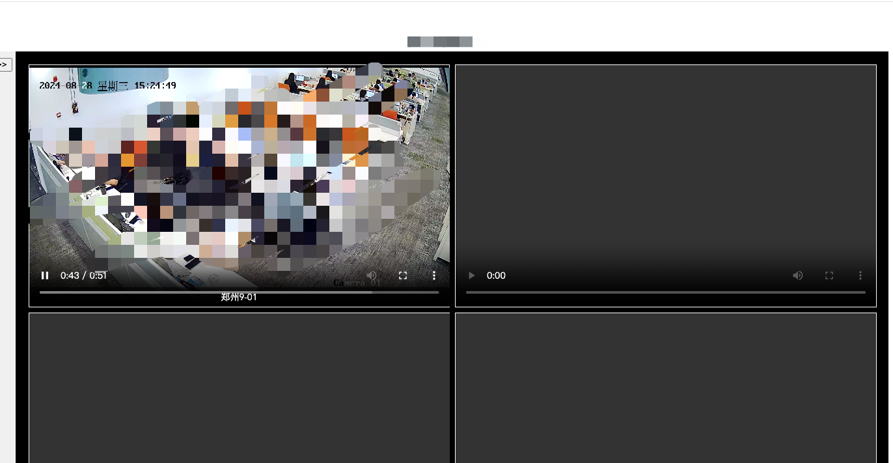

## 第一步：了解海康微视的端口

### 1.去硬盘录像机的后台
主要原因有两个：
- 创建账户
- 重置账户

### 2. 录像机的后台关于账户密码开启端口映射
首先了解海康超级密码，也可以拨打客服进行咨询，只要能进入录像机配置就不会发生变更，选择恢复简单的配置等待机器重启后即可重置密码，前提需要知道图形或者某密码进入后台否则只能重新配置目前没有重置所有的操作也不考虑了

### 3. 端口映射方式
选择端口映射即可，关于upnp一般不是单独的专线或者拨号，所以不用考虑，结合实际场景，端口映射端口转发  看下rtsp流媒体协议端口一般为554  内网不用重置

### 4. 部署服务机器
1.dockerfile（https://github.com/deepch/RTSPtoWeb/blob/master/README.md）
RTSPtoWeb 是一个非常实用的工具，用于将 RTSP 流转换为 WebRTC 或 HLS 格式，方便通过网页浏览器进行播放。以下是如何安装和使用 RTSPtoWeb 的步骤：
docker 中找到rtsptoweb的协议，这样就可以自己定制前端页面用来实现流媒体服务了，先了解下教程怎么部署
-.访问rtsptoweb官网进行文件下载，go语言编辑，我们先把服务配置文件下载到本地
或者：docker run --rm -it -p 8083:8083 aler9/rtsp-to-web  
关于rtsptoweb  也可以去官网了解下，docker run 不一定下载下来，可以下载github源文件生成dockerfile 注意依赖项目有一些咨询也需要安装，最后文件映射即可 最后docker compose up d 部署成功 完美
---

##  5. 部署服务机器
了解海康媒体流配置
https://knowbot.hikvision.com/webchatbot-new/#/sharingPathMob?lang=zh_CN&params=379485&sysNum=1693447044565
## 遇到了一个奇葩的问题，这个问题一度让我认为这个事情做的不成功，不完美
说说后来怎么发现发现问题与解决思路吧，也帮助有幸浏览到这篇文章的同学避避坑
遇到一个什么问题呢，通过主机服务端口映射出去的视频，没办法通过hls与hlss播放，websocket也无法正常播放，为什么。但是通过内网加载ip是正常的
查找原因：期间我使用了obs获取的流，内网正常显示，一样外部端口无法获取成功
排查方式：一开始我以为端口映射问题，想使用upnp，但是upnp 企业路由器不支持，又去查看dmz方式一对一映射，结果还是不行，在h3c路由器的配置中有一个nat配置下针对rtsp协议的配置，但是这个是默认开启的，经过了解协议与端口，发现配置均没有问题，继续排查吧，下载vlc播放试试，一开始我认为obs这个插件就够强大了，但是我是在h3c也就是我的路由器的问题论坛中快问快答一个网友回复我的，那我用vlc试试看，果真可以正常播放，但是加载慢比内网中慢了很多但连的通就不是配置问题，所以不得不让我怀疑是数据流的问题，那么我的视频流媒体是什么样子的呢，h265编码是在硬盘录像机的协议  相对于h265咱也不是很清楚，应该新版本必究版本呢好，应该兼容才对，所以没有修改h265的编码，继续排查，在对流媒体中有个简单的方式调试ffmpeg仅,
brew update
brew upgrade ffmpeg
那就简单的获取试试，看看有无可用的连接不上的信息可以供我解决，
ffmpeg -i rtsp://留信息/Streaming/Channels/101 -vf scale=1280:720 -c:v libx264 -c:a aac output.mp4  指定了尺寸的
ffmpeg -loglevel debug -analyzeduration 30M -probesize 30M -i rtsp://******/Streaming/Channels/101  加了缓存的

ffmpeg -loglevel debug -analyzeduration 30M -probesize 30M -i rtsp://XXXX4/Streaming/Channels/101  指定tcp端口的
以上都是请求半天无响应，最后换了如下
ffmpeg -i rtsp:/********、Streaming/Channels/101 -c:v libx264 -c:a aac output.mp4   转码格式的  libx264

最后发现libx264 有戏，那么问题就已经找到了,可能是格式不支持或者265对数据传输要求校稿，我的媒体播放器不支持导致

修改视频编码在海康录像机的通道h265的编码 替换h264，利用rtsptoweb webview debug  成功解决了！！！！！


## 前端连接
``` bash
<template>
  <div style="border: 1cap;block-size: auto;font-size: large;font-weight: 100;">Test</div>
  <div class="video-player-container">
    <div :class="['sidebar', { 'sidebar-collapsed': !isListOpen }]">
      <button @click="toggleList">
        {{ isListOpen ? '<<' : '>>' }}
      </button>
      <ul v-show="isListOpen" id="streamList">
        <li v-for="(stream, streamId) in streams" :key="streamId"
          @click="handleStreamClick(streamId)">
          {{ stream.name }}
        </li>
      </ul>
    </div>
    <div class="video-grid">
      <div v-for="(video, index) in videoGrid" :key="index" class="video-cell" @click="replaceStream(index)">
        <video :id="'videoElement' + index" controls></video>
        <div v-if="video" class="overlay">{{ streams[video.streamId].name }}</div>
      </div>
    </div>
  </div>
</template>

<script>
import Hls from 'hls.js';

export default {
  data() {
    return {
      streams: [], // 存储流数据
      videoGrid: Array(4).fill(null), // 初始化4个视频画面为空
      isPlaying: false, // 播放状态
      hlsInstances: Array(4).fill(null), // HLS 对象的数组
      isListOpen: true, // 控制列表的展开和收起
      selectedGridIndex: null // 选中的网格索引
    };
  },
  created() {
    this.fetchStreamList();
  },
  methods: {
    // 获取流列表
    fetchStreamList() {
      const apiUrl = 'http://1.1.1.1:1565/streams';
      const username = 'demo'; // 默认用户名
      const password = 'demo'; // 默认密码
      const credentials = btoa(`${username}:${password}`);

      fetch(apiUrl, {
        headers: {
          'Authorization': `Basic ${credentials}`
        }
      })
        .then(response => {
          if (!response.ok) {
            throw new Error(`HTTP error! Status: ${response.status}`);
          }
          return response.json();
        })
        .then(data => {
          if (data.status === 1 && data.payload) {
            this.streams = data.payload; // 更新组件的数据
          } else {
            throw new Error('Invalid data format');
          }
        })
        .catch(error => {
          console.error('Failed to fetch stream list:', error);
        });
    },
    // 处理点击流列表项
    handleStreamClick(streamId) {
      const availableIndex = this.videoGrid.findIndex(video => video === null);
      if (availableIndex !== -1) {
        // 如果有空位，直接播放
        this.addStreamToGrid(availableIndex, streamId);
      } else {
        // 如果没有空位，提示用户选择一个画面进行替换
        this.selectedGridIndex = prompt('All slots are full. Enter the index (0-3) to replace:');
        if (this.selectedGridIndex !== null && this.selectedGridIndex >= 0 && this.selectedGridIndex < 4) {
          this.replaceStream(this.selectedGridIndex, streamId);
        }
      }
    },
    // 将流添加到视频网格中
    addStreamToGrid(gridIndex, streamId) {
      const channelId = Object.keys(this.streams[streamId].channels)[0];
      this.videoGrid[gridIndex] = { streamId, channelId };
      this.$nextTick(() => {
        this.playStream(gridIndex, streamId, channelId);
      });
    },
    // 替换现有的视频流
    replaceStream(gridIndex, streamId) {
      const channelId = Object.keys(this.streams[streamId].channels)[0];
      this.videoGrid[gridIndex] = { streamId, channelId };
      this.$nextTick(() => {
        this.playStream(gridIndex, streamId, channelId);
      });
    },
    // 播放视频流
    playStream(gridIndex, streamId, channelId) {
      const hlsUrl = `http://1.1.1.1:1565/stream/${streamId}/channel/${channelId}/hlsll/live/index.m3u8`;

      // 清理之前的 HLS 实例
      if (this.hlsInstances[gridIndex]) {
        this.hlsInstances[gridIndex].destroy();
        this.hlsInstances[gridIndex] = null;
      }

      const video = document.getElementById('videoElement' + gridIndex);

      if (Hls.isSupported()) {
        const hls = new Hls();
        hls.loadSource(hlsUrl);
        hls.attachMedia(video);
        hls.on(Hls.Events.MANIFEST_PARSED, () => {
          video.play();
          this.isPlaying = true; // 更新播放状态
        });
        this.hlsInstances[gridIndex] = hls; // 保存 HLS 实例
      } else if (video.canPlayType('application/vnd.apple.mpegurl')) {
        video.src = hlsUrl;
        video.addEventListener('loadedmetadata', () => {
          video.play();
          this.isPlaying = true; // 更新播放状态
        });
      } else {
        console.error('HLS not supported and video cannot play');
      }
    },
    // 切换列表的显示状态
    toggleList() {
      this.isListOpen = !this.isListOpen;
    }
  },
  beforeUnmount() {
    // 清理所有 HLS 实例
    this.hlsInstances.forEach(hls => {
      if (hls) {
        hls.destroy();
      }
    });
  }
};
</script>

<style scoped>
.video-player-container {
  display: flex;
  flex-direction: row;
}

.sidebar {
  width: 200px;
  transition: width 0.3s ease;
  background-color: #f0f0f0;
  padding: 10px;
  display: flex;
  flex-direction: column;
}

.sidebar-collapsed {
  width: 40px;
  padding: 10px 5px;
}

.sidebar button {
  width: 100%;
  margin-bottom: 10px;
}

#streamList {
  list-style: none;
  padding: 0;
  overflow-y: auto;
}

#streamList li {
  cursor: pointer;
  padding: 5px;
  margin: 5px 0;
  background-color: #ddd;
}

#streamList li:hover {
  background-color: #ccc;
}

.video-grid {
  flex-grow: 1;
  display: grid;
  grid-template-columns: repeat(2, 1fr);
  grid-template-rows: repeat(2, 1fr);
  gap: 10px;
  padding: 20px; /* 上下左右保留一定空白边距 */
  box-sizing: border-box; /* 确保 padding 不影响网格大小 */
  background-color: #000;
}

.video-cell {
  position: relative;
  width: 100%;
  height: 100%;
  border: 1px solid #fff;
}

video {
  width: 100%;
  height: 100%;
}

.overlay {
  position: absolute;
  bottom: 0;
  left: 0;
  width: 100%;
  background-color: rgba(0, 0, 0, 0.5);
  color: #fff;
  text-align: center;
  padding: 5px 0;
  font-size: 14px;
}
</style>

``` 
### 效果最后演示
